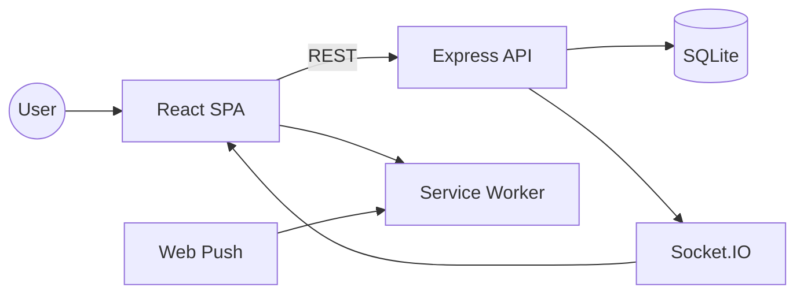

# Architecture & System Flow

## Component Interaction

## Request Flow (Typical)
1. User logs in via REST `/api/auth/login`.
2. UI fetches updates `/api/updates` and analytics endpoints.
3. New updates emit `update:new` over Socket.IO; clients update in real time.
4. Service worker caches recent data for offline read.
5. Push notifications deliver updates when configured.
