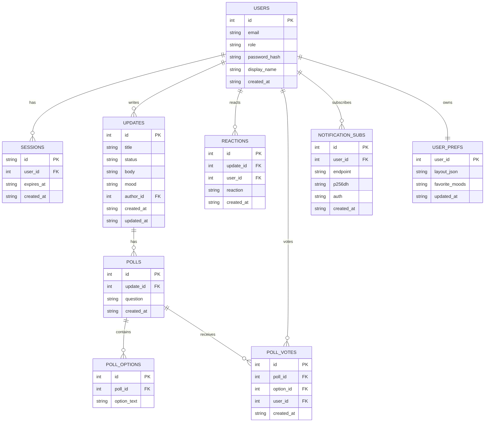

# Database Schema (ER)

```mermaid
erDiagram
  USERS ||--o{ SESSIONS : has
  USERS ||--o{ UPDATES : writes
  USERS ||--o{ REACTIONS : reacts
  USERS ||--o{ POLL_VOTES : votes
  UPDATES ||--o{ POLLS : has
  POLLS ||--o{ POLL_OPTIONS : contains
  POLLS ||--o{ POLL_VOTES : receives
  USERS ||--o{ NOTIFICATION_SUBS : subscribes
  USERS ||--|| USER_PREFS : owns

  USERS {
    int id PK
    string email
    string role
    string password_hash
    string display_name
    string created_at
  }

  SESSIONS {
    string id PK
    int user_id FK
    string expires_at
    string created_at
  }

  UPDATES {
    int id PK
    string title
    string status
    string body
    string mood
    int author_id FK
    string created_at
    string updated_at
  }

  POLLS {
    int id PK
    int update_id FK
    string question
    string created_at
  }

  POLL_OPTIONS {
    int id PK
    int poll_id FK
    string option_text
  }

  POLL_VOTES {
    int id PK
    int poll_id FK
    int option_id FK
    int user_id FK
    string created_at
  }

  REACTIONS {
    int id PK
    int update_id FK
    int user_id FK
    string reaction
    string created_at
  }

  NOTIFICATION_SUBS {
    int id PK
    int user_id FK
    string endpoint
    string p256dh
    string auth
    string created_at
  }

  USER_PREFS {
    int user_id PK
    string layout_json
    string favorite_moods
    string updated_at
  }
```
